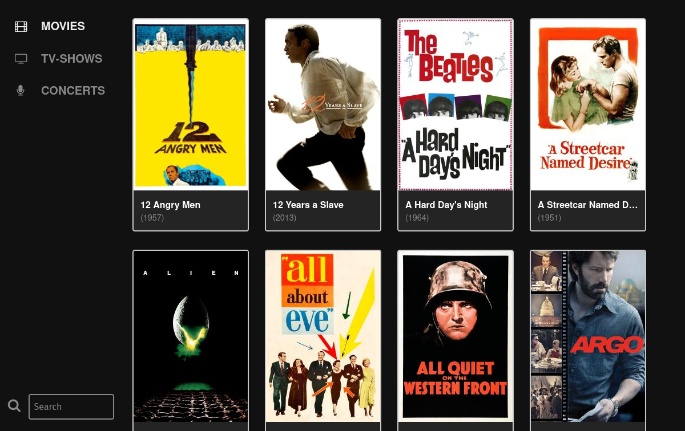
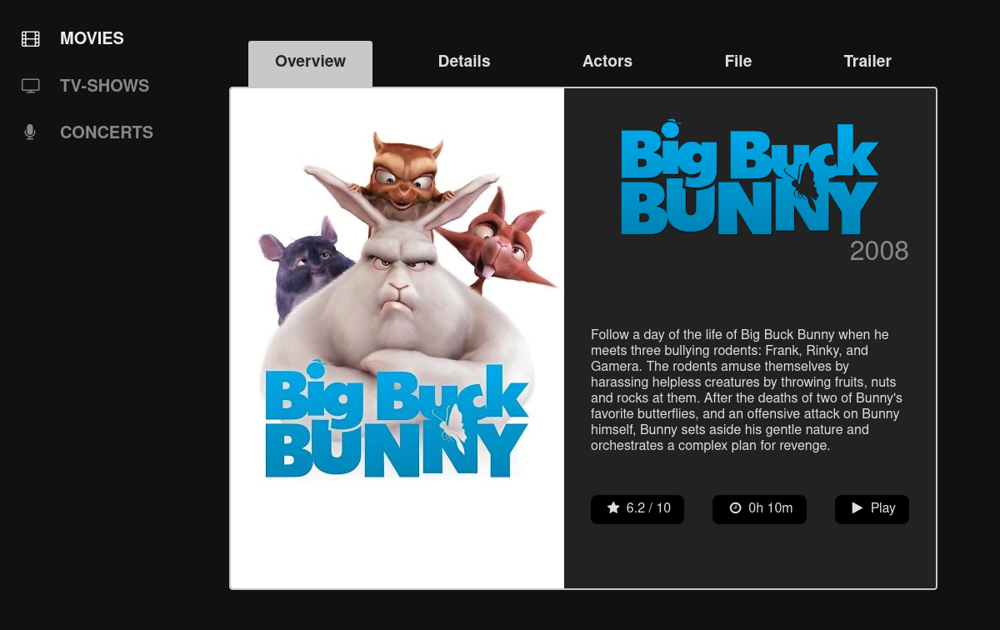

# hidaya

An export-theme for [MediaElch](http://www.mediaelch.de/).

Overview:

Single Movie:

### manual  installation

The theme should be located at the following places:

- Mac OS: `/Users/username/Library/Application Support/kvibes/MediaElch/export_themes/hidaya`
- Linux: `/home/username/.local/share/kvibes/MediaElch/export_themes/hidaya`
- Windows: `C:\Users\username\AppData\Local\kvibes\MediaElch\export_themes\hidaya`